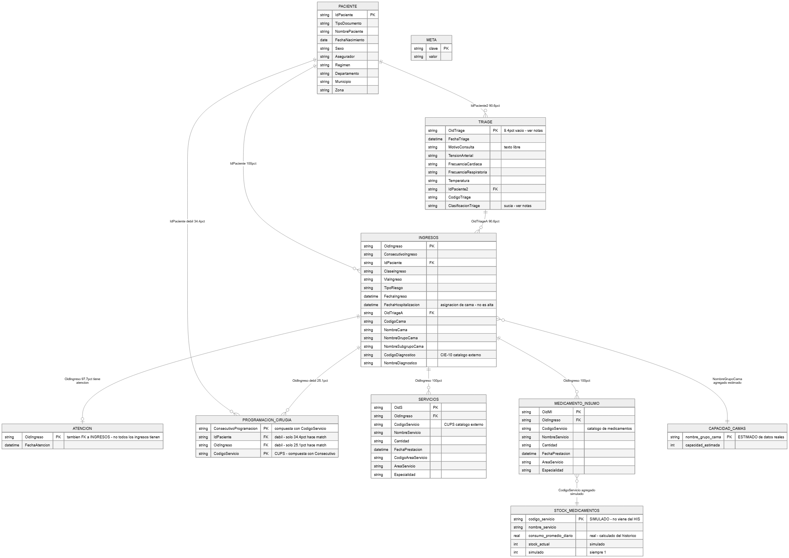
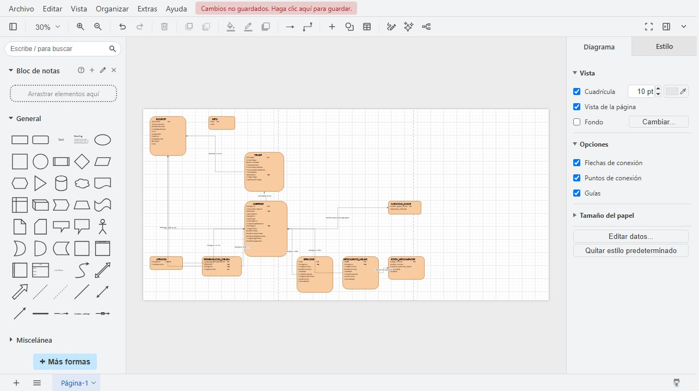

# Modelo relacional — HIS hackaton-fup

Extraído y verificado directamente de `data/hackaton.db` (no de los PDFs de
referencia, que a veces no coinciden con los archivos reales — ver
[DECISIONS.md](../DECISIONS.md)). Cada llave y cada porcentaje de este
documento viene de una consulta real, no de inspección visual. Fuente del
diagrama: [modelo-relacional.mmd](modelo-relacional.mmd) (edítalo y vuelve a
renderizar con `/diagram` si el esquema cambia).

### Versión alternativa (estilo clásico, editable en draw.io)

[modelo-relacional.drawio](modelo-relacional.drawio) — mismo esquema, en el
estilo clásico de diagrama ER (cajas naranjas, PK en negrita, FK en cursiva).
Ábrelo gratis en [app.diagrams.net](https://app.diagrams.net) (Archivo →
Abrir) o en la app de escritorio de draw.io; ahí puedes reacomodar las cajas,
cambiar colores o exportarlo a PNG/PDF para una presentación. Vista previa:

Se genera con [generate_drawio.py](generate_drawio.py) a partir del mismo
esquema verificado — si la base cambia, edita ese script (no el `.drawio` a
mano) y vuelve a correrlo.

## Cómo leer las relaciones

Cada línea del diagrama trae el % de filas del lado "muchos" que
efectivamente encuentran una fila coincidente del lado "uno" — es la
integridad referencial real, medida con `COUNT(*) ... WHERE EXISTS (...)`.
Por debajo de ~95% significa que un `JOIN` normal (`INNER JOIN`) va a botar
filas silenciosamente; para esos casos, usar `LEFT JOIN` y decidir a
propósito qué hacer con los que no encuentran par.

## Tablas del HIS (reales)

### `paciente` — 14.502 filas
PK: `IdPaciente` (única, sin vacíos, verificado).

| Columna | Tipo | Notas |
|---|---|---|
| IdPaciente | texto | **PK** |
| TipoDocumento | texto | CC, TI, etc. |
| NombrePaciente | texto | Iniciales/seudónimo, no el nombre real |
| FechaNacimiento | fecha | |
| Sexo | texto | |
| Asegurador | texto | Nombre de la EPS |
| Regimen | texto | Contributivo / Subsidiado / etc. |
| Departamento, Municipio, Zona | texto | Ubicación |

### `ingresos` — 17.781 filas — tabla pivote central
PK: `OidIngreso` (única, sin vacíos, verificado).

| Columna | Tipo | Notas |
|---|---|---|
| OidIngreso | texto | **PK** |
| ConsecutivoIngreso | texto | |
| IdPaciente | texto | **FK** → `paciente.IdPaciente` (100% match) |
| ClaseIngreso | texto | Ambulatorio / Hospitalario |
| ViaIngreso | texto | |
| TipoRiesgo | texto | |
| FechaIngreso | fecha/hora | Llegada del paciente |
| FechaHospitalizacion | fecha/hora | **No es fecha de alta** — es cuándo se asignó la cama. No existe fecha de egreso en los datos (ver DECISIONS.md #2). |
| OidTriageA | texto | **FK** → `triage.OidTriage` (90.6% match — el resto son los ~1.675 triage con `OidTriage` vacío) |
| CodigoCama, NombreCama | texto | |
| NombreGrupoCama | texto | Servicio (URGENCIAS, UCI, PEDIATRIA...) — usado para KPIs de ocupación |
| NombreSubgrupoCama | texto | |
| CodigoDiagnostico | texto | Código **CIE-10** — catálogo externo, no hay tabla local |
| NombreDiagnostico | texto | |

### `atencion` — 17.375 filas
PK: `OidIngreso` (única dentro de la tabla, sin vacíos).

| Columna | Tipo | Notas |
|---|---|---|
| OidIngreso | texto | **PK**, también **FK** → `ingresos.OidIngreso` (100% de las filas de `atencion` sí tienen un ingreso real). Pero solo 17.375/17.781 ingresos (97.7%) tienen fila en `atencion` — no todo ingreso tuvo una primera atención registrada. |
| FechaAtencion | fecha/hora | |

### `triage` — 17.781 filas
PK: `OidTriage` — **no siempre único ni presente**: 16.106 valores distintos de 17.781 filas, 1.675 vacíos (~9.4%). Ver DECISIONS.md #5.

| Columna | Tipo | Notas |
|---|---|---|
| OidTriage | texto | **PK** (con las salvedades de arriba) |
| FechaTriage | fecha/hora | |
| MotivoConsulta | texto | Texto libre, sintético (dataset del hackatón) |
| TensionArterial, FrecuenciaCardiaca, FrecuenciaRespiratoria, Temperatura | texto | Signos vitales |
| IdPaciente2 | texto | **FK** → `paciente.IdPaciente` (90.6% match, mismo patrón que `OidTriage` vacío) |
| CodigoTriage | texto | |
| ClasificacionTriage | texto | **Sucia**: mezcla ubicación/tipo de consulta/color con el nivel real (1-4). Ver DECISIONS.md #5 para cómo extraer el nivel. |

### `programacion_cirugia` — 13.046 filas
PK **compuesta**: (`ConsecutivoProgramacion`, `CodigoServicio`) — verificada única (13.046/13.046). `ConsecutivoProgramacion` por sí solo **no es único** (una cirugía programada puede incluir varios procedimientos/CUPS).

| Columna | Tipo | Notas |
|---|---|---|
| ConsecutivoProgramacion | texto | **PK** (compuesta) |
| IdPaciente | texto | **FK débil** → `paciente.IdPaciente` — solo 34.4% (4.492/13.046) hace match |
| OidIngreso | texto | **FK débil** → `ingresos.OidIngreso` — solo 25.1% (3.277/13.046) hace match. Desglose completo en DECISIONS.md. |
| CodigoServicio | texto | **PK** (compuesta) — código **CUPS**, catálogo externo |

> ⚠️ **La más frágil de las siete tablas.** No tiene fecha propia: cualquier
> serie de tiempo ("cirugías por semana") depende del `JOIN` con
> `ingresos.FechaIngreso`, que solo cubre ~25% de las filas.

### `servicios` — 582.357 filas
PK: `OidS` (única, sin vacíos, verificado).

| Columna | Tipo | Notas |
|---|---|---|
| OidS | texto | **PK** |
| OidIngreso | texto | **FK** → `ingresos.OidIngreso` (100% match) |
| CodigoServicio | texto | Código **CUPS** — catálogo externo |
| NombreServicio | texto | Examen/laboratorio/imagen/procedimiento |
| Cantidad | texto | |
| FechaPrestacion | fecha/hora | |
| CodigoAreaServicio, AreaServicio, Especialidad | texto | |

### `medicamento_insumo` — 579.465 filas
PK: `OidMI` (única, sin vacíos, verificado).

| Columna | Tipo | Notas |
|---|---|---|
| OidMI | texto | **PK** |
| OidIngreso | texto | **FK** → `ingresos.OidIngreso` (100% match) |
| CodigoServicio | texto | Código del medicamento/insumo |
| NombreServicio | texto | |
| Cantidad | texto | Dispensado |
| FechaPrestacion | fecha/hora | |
| AreaServicio, Especialidad | texto | |

## Tablas derivadas (generadas por `scripts/build_db.py`, no vienen del HIS)

### `stock_medicamentos` — 1.327 filas — **SIMULADA**
PK: `codigo_servicio`. Agrupa `medicamento_insumo` por `CodigoServicio`. `stock_actual` es un valor **inventado** (semilla fija, reproducible); `consumo_promedio_diario` sí es real. Ver DECISIONS.md #3 — **decirlo en la demo**.

### `capacidad_camas` — 9 filas — **ESTIMADA de datos reales**
PK: `nombre_grupo_cama`. Cuenta camas (`CodigoCama`) distintas observadas en todo el histórico de `ingresos`, agrupadas por `NombreGrupoCama`. No es la capacidad física real del hospital. Ver DECISIONS.md #4.

### `meta` — 5 filas — configuración
PK: `clave`. Pares clave/valor: `fecha_corte_demo`, `umbral_dias_inventario_bajo`, `umbral_ocupacion_alerta_pct`, `umbral_ocupacion_critica_pct`, `stock_medicamentos_simulado`. La leen el agente, el dashboard y `scripts/check_alerts.py` — un solo lugar de verdad, no repetir estos valores hardcodeados en otro código nuevo.

## Catálogos externos (no son tablas locales)

- **CIE-10** (`ingresos.CodigoDiagnostico`): diagnósticos. Definiciones en `Insumos Hackaton/Glosario_Terminos_Salud_HIS.pdf` (indexado para RAG en `glosario_fts`).
- **CUPS** (`CodigoServicio` en `servicios` y `programacion_cirugia`): procedimientos/servicios. Mismo glosario.
- El código de medicamento en `medicamento_insumo.CodigoServicio` **no** es CUPS — es un identificador propio del catálogo de farmacia del HIS, no está documentado como catálogo externo en los materiales del reto.

## Para diseñar casos de uso: qué evitar

1. **No asumas `INNER JOIN` limpio con `programacion_cirugia`.** Solo ~25-34% conecta con `ingresos`/`paciente`. Un caso de uso tipo "¿qué cirugías tiene programadas el paciente X?" solo va a encontrar una fracción de las reales.
2. **`triage` no es 1:1 confiable con `ingresos`.** ~9.4% de los triage no tienen id o paciente asociado.
3. **`atencion` es opcional**, no todo ingreso tiene una fila ahí (2.2% no la tienen).
4. **`CodigoDiagnostico` y `CodigoServicio` son texto libre de un catálogo externo** — no hay tabla local para validarlos ni traducir el código a su nombre completo salvo lo que ya venga en `NombreDiagnostico`/`NombreServicio` de la misma fila, o buscando el concepto en el glosario (RAG).
5. **Ningún campo de fecha en `ingresos` es "fecha de alta".** Cualquier caso de uso sobre duración de estancia tiene que decidir un supuesto (ver DECISIONS.md #2) y decirlo explícitamente.
